# Project Title 
Printing Shop Management System

## Project Description
A console-based Printing Shop Management System developed using Python and SQLite. The system helps manage 
customers, stock, printing jobs, pricing, and generates sales reports for a small printing business.

## Features
1. Customer Management
2. Stock Management
3. Printing Jobs 
4. Sales Management 
5. Sales Reports
6. Daily Sales Reports
7. Customer Printing History
8. Stock History
9. Soft Delete
10. Settings Module

## Technologies Used
1. Language - Python 
2. Database - SQLite 
3. Text Editor - PyCharm

## Project Structure
These are the Project Modules

1. main.py
2. customer.py
3. stock.py
4. set_price.py
5. printing.py
6. reports.py
7. database.py

## Database Design
Database Tables

1. Customers
2. Print Jobs
3. Stock
4. Stock History
5. Settings Price

## How to Run the Project
1. Install Python 3.14 or later
2. Open the project folder in PyCharm
3. Run main.py
4. The database will be created automatically if it does not already exist.

## Project Status
Version 1.0 - Completed

✔ Customer Management
✔ Stock Management
✔ Printing Module
✔ Reports
✔ Settings
✔ Fully Tested

## Screenshots
#### Main Menu
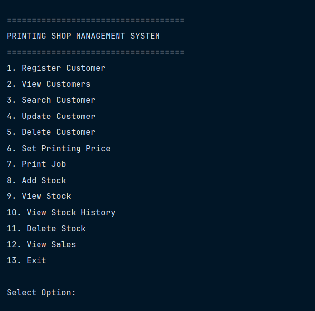

#### Customer Registration
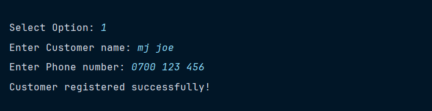

#### View Customer
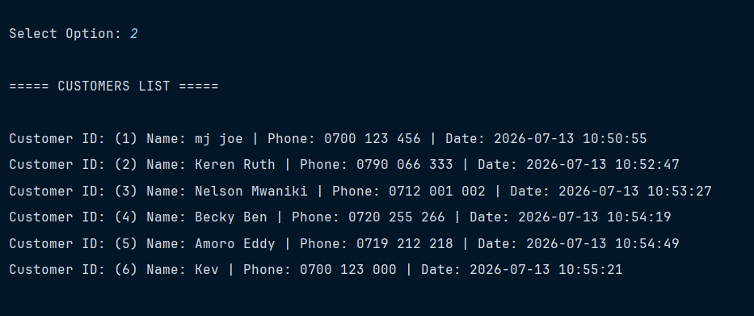

#### Search Customer
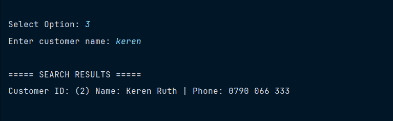

#### Update Customer
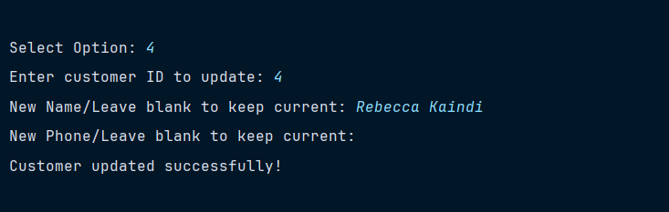

#### Delete Customer
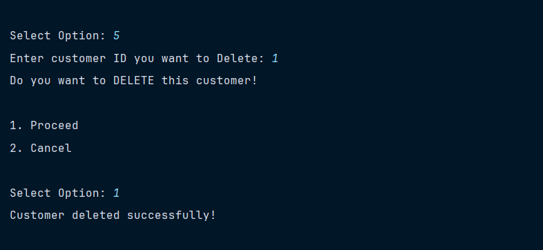

#### Print Price
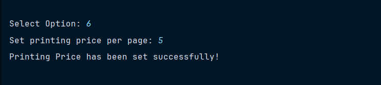

#### Add Stock
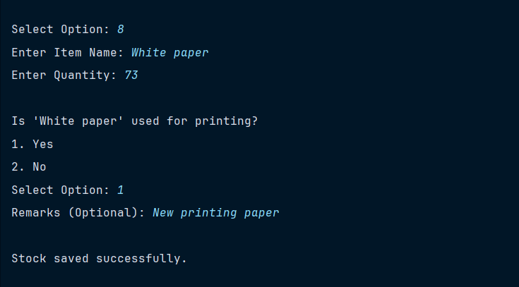

#### View Stock
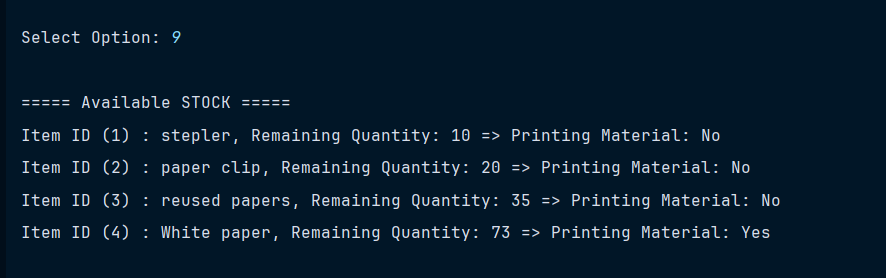

#### Print Job
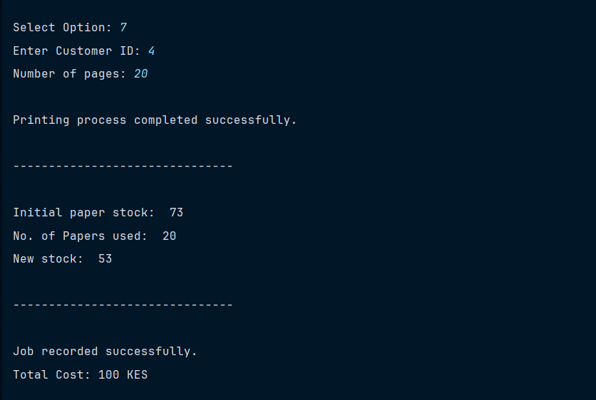

#### Delete Stock
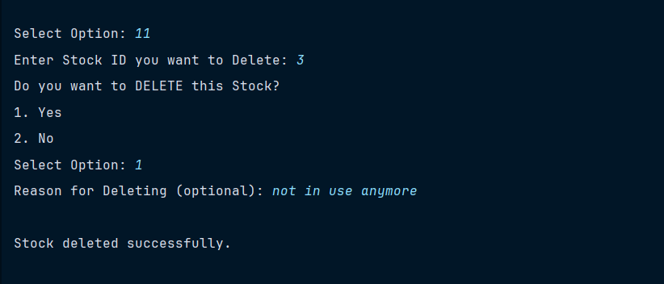

#### View Stock History
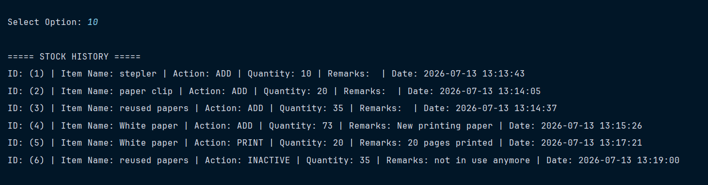

#### Sales Summary
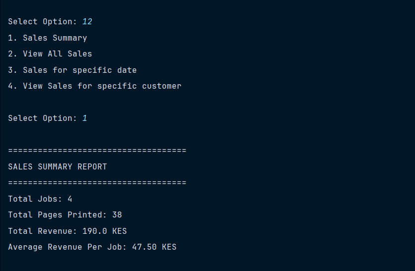

#### All Sales Summary
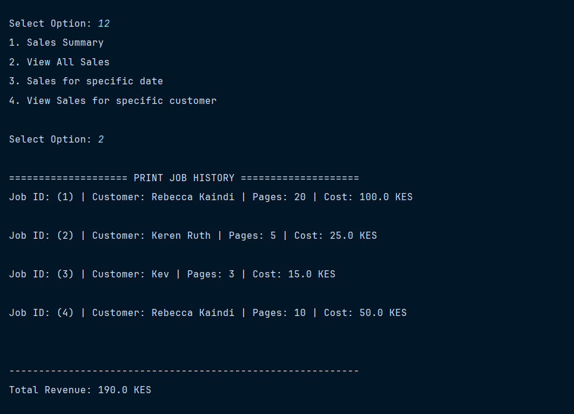

#### Specific Date Report
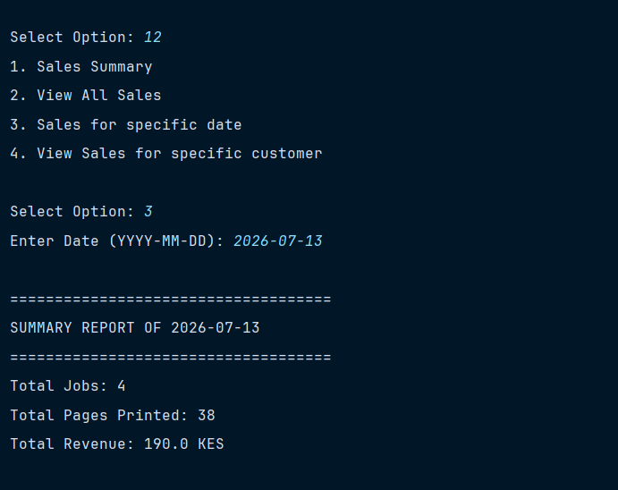

#### Specific Customer Report
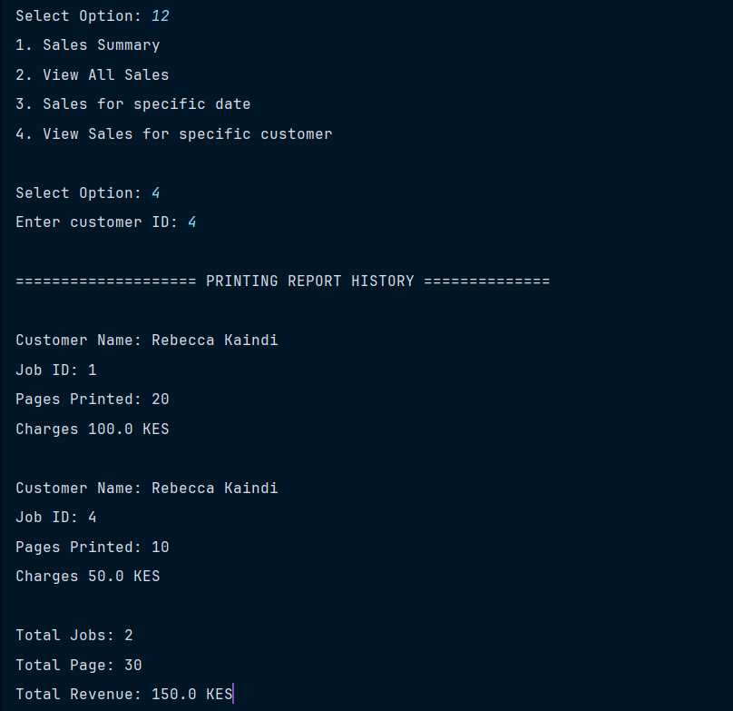

#### Exit
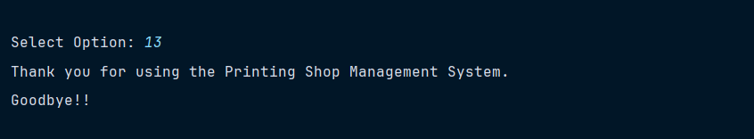

## Lessons Learned
- Modular programming using Python
- Working with SQLite databases
- CRUD operations
- SQL JOIN queries
- Business rule implementation
- Database transaction management
- Debugging SQLite locking issues

## Future Improvements
- Version 1.0 → Console
- Version 2.0 → Tkinter 
- Version 3.0 → Flask
- Version 4.0 → Django

## Skills Demonstrated
- Python Programming
- SQLite Database Design
- CRUD Operations
- SQL Queries
- Modular Programming
- Business Logic Implementation
- Debugging and Problem-Solving

## Author
Joeson Misiani