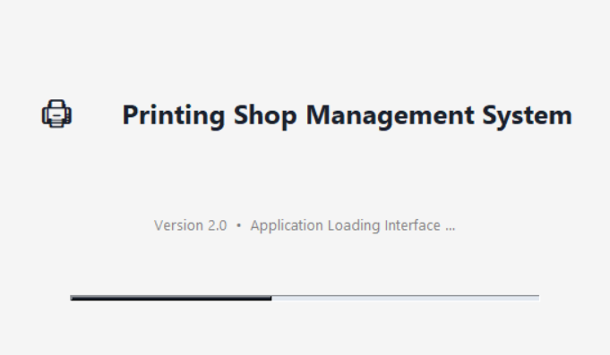
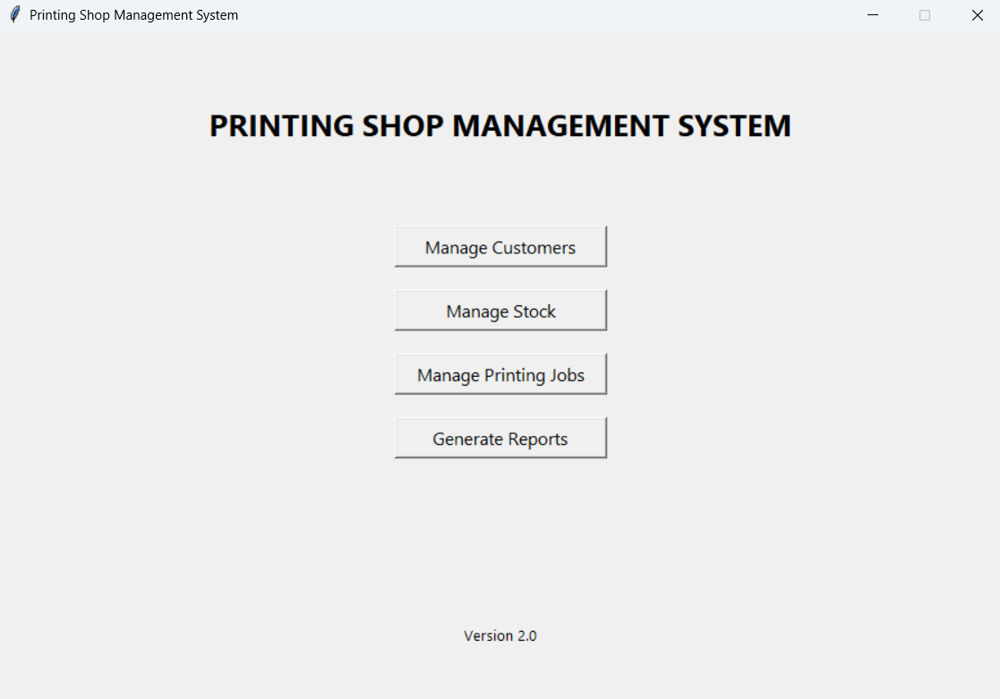
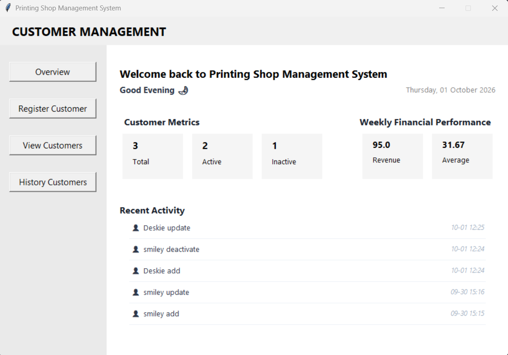
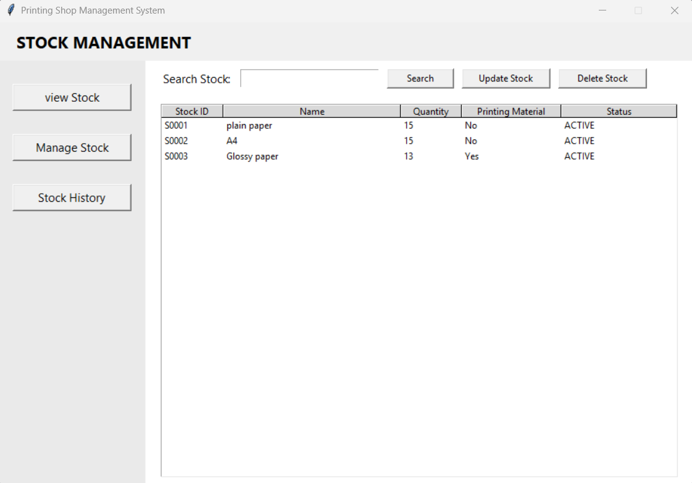
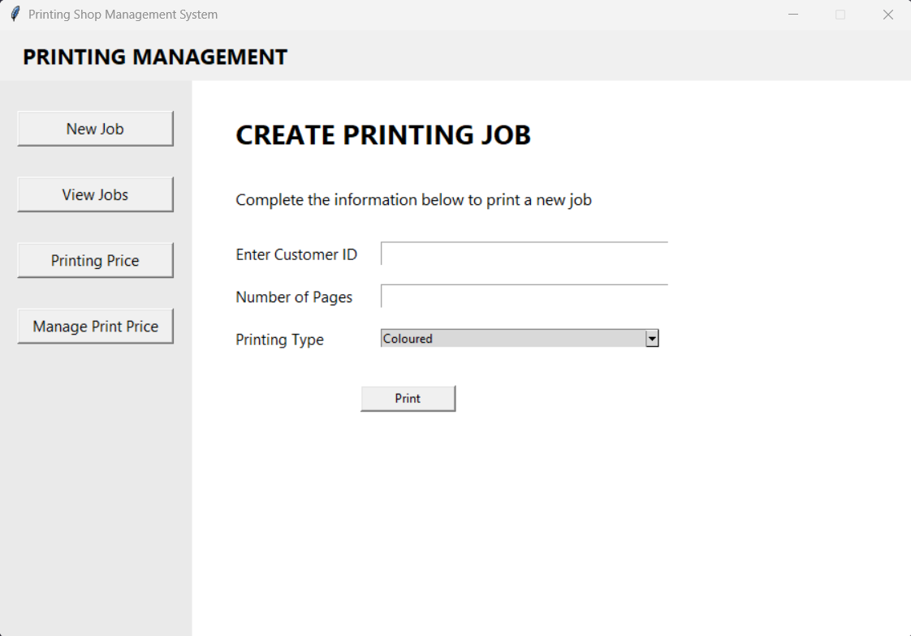
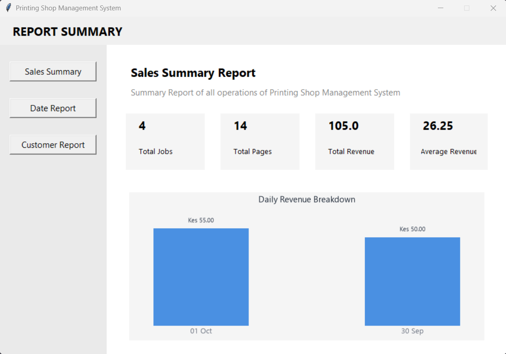
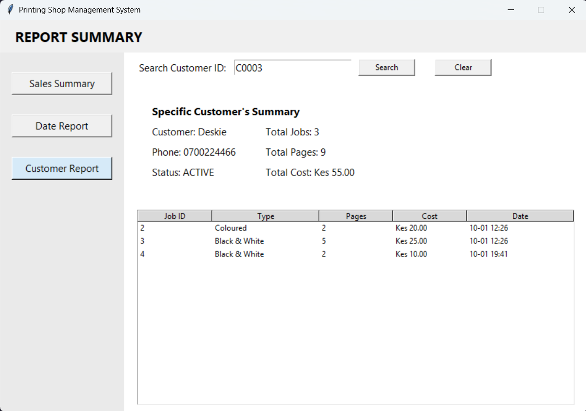

# Project Title 
Printing Shop Management System V2

## Project Description
A Python/Tkinter/SQLite desktop application that helps in managing customers, stock, printing jobs, pricing, and generates sales reports for a small printing business.

## Features
1. Customer Management
2. Stock Management
3. Printing Jobs 
4. Pricing 
5. Sales Reports
6. Daily Sales Reports
7. Customer Printing History
8. Stock History
9. Soft Delete

## Technologies Used
1. Language - Python 
2. Database - SQLite 
3. Text Editor - PyCharm
4. GUI Interface - Tkinter
5. Displaying sales charts - Matplotlib
6. Working with dates and times - TkCalendar

## Project Structure
These are the Project Modules

1. dashboard.py
2. window_customer.py
3. window_stock.py
4. window_print.py
5. window_report.py
6. database.py

## Database Design
Database Tables

1. tbl_customers
2. tbl_customers_history
3. tbl_stock
4. stock_history
5. printing_price
6. tbl_print_jobs

## How to Run the Project
1. Install Python 3.14 or later
2. Open the project folder in PyCharm
3. Run gui/dashboard.py
4. The database will be created automatically if it does not already exist.

## Project Status
Version 2.0 - Completed

✔ Customer Window
✔ Stock Window
✔ Printing Window
✔ Reports Window
✔ Fully Tested

## Screenshots
#### Splash screen

#### Dashboard

#### View Customer

#### Manage Stock

#### New Print Job

#### Summary Report

#### Customer Report

## Lessons Learned
- Modular programming using Python
- Working with SQLite databases
- CRUD operations
- SQL JOIN queries
- Business rule implementation
- Database transaction management
- Building desktop graphical user interfaces using Tkinter
- Connecting Tkinter GUI components to database operations
- Managing multiple application windows using Tkinter
- Form validation and user input handling
- Using Treeview to display and manage database records
- Implementing search, filtering, and sorting in a graphical interface
- Maintaining application state between GUI operations

## Future Improvements
- Version 1.0 → Console
- Version 2.0 → Tkinter 
- Version 3.0 → Flask
- Version 4.0 → Django

## Skills Demonstrated
- Python Programming
- Modular Programming
- SQLite Database Design
- CRUD Operations
- SQL Queries and JOINs
- Database Transactions
- Business Logic Implementation
- Data Validation
- Tkinter GUI Development
- Desktop Application Development
- GUI and Database Integration
- Form Handling and User Input Validation
- Treeview Data Management
- Search and Record Filtering
- Record Status Management
- History and Audit Record Management
- Debugging and Problem-Solving

## Author
Joeson Misiani